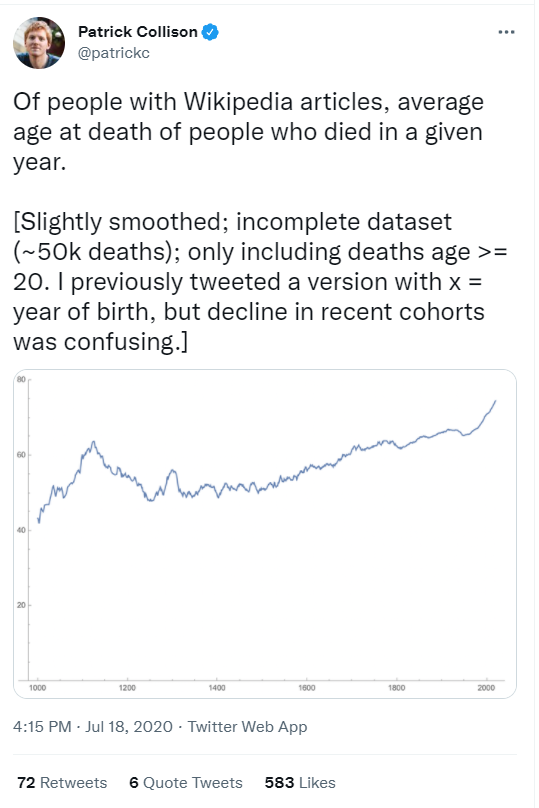

This is a post for future Mara. 

For every post I seem to run into the same issue: including images!

This is a post to remind myself and help anyone else out there battling blogdown's behavior with looking in unexpected places for images. 



```{r}
knitr::include_graphics("~/All_of_Maras_R/website/MaraAlexeev.github.io/public/images")
```

